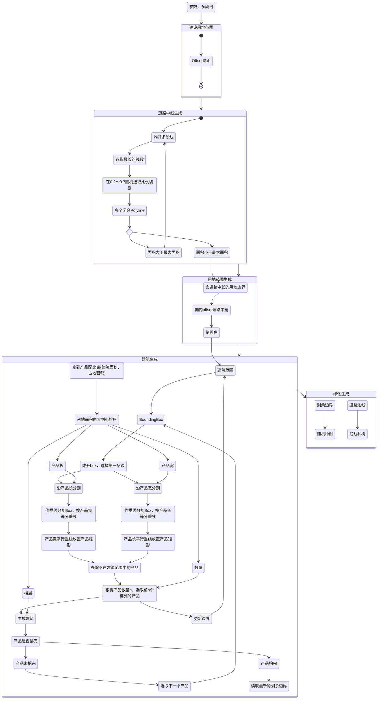

# 强排算法

一个道路主导的设计流程

## **输入参数**

### **用地边界（闭合polyline）**

### 一些参数

| 参数名称 | 所属模块 | 默认数值 |
| --- | --- | --- |
| 退线距离 | 建设范围计算 | 7m |
| 地块的最大面积 | 道路生成 | 10000m2 |
| 随机因子 | 道路生成 | 17 |
| 是否环路 | 道路生成 | False |
| 道路宽度 | 地块生成 | 7m |
| *arg: 随机因子 | 地块生成 | None |
| 消防间距 | 建筑生成 | 10m |
| 产品面积 | 建筑生成 | [14500, 1500, 500] |
| 产品层数 | 建筑生成 | [6,3,2] |
| 产品数量 | 建筑生成 | [2, 12, 22] |
| *arg: 随机因子 | 建筑生成 | 27 |
| 强制朝向 | 建筑生成 | True |
| *arg: 种树密度 | 种树模块 | None |

---

## 算法框架

1. 输入参数
2. 建设范围
3. 道路生成
4. 用地内部划分
5. 建筑生成
6. 绿化生成

---

### 建设范围

这一部分的主要作用就是输出一个用地边界的polyline

`输入参数：`范围边线，退线距离

`算法逻辑：`重建polyline，保证其在同一个Z轴坐标上，保证其为顺时针方向的多段线，输入正直可以向内offset。最后简化数据结构输出建筑退线。

`业务逻辑：`用地红线向内offset，每个边向内偏移相同的距离。

`一些疑惑：` 

1. 为什么不像两个方向offset呢？选择短线为向内偏移，选择长线为向外偏移。
2. 现实情况可能是不同的城市道路，退距不一样。

---

### 内部道路中线生成

将用地边界划分正多个满足面积要求的Polyline

`输入参数：` 上一级输出的Polyline

| 参数名称 | 所属模块 | 默认数值 |
| --- | --- | --- |
| 地块的最大面积 | 道路生成 | 10000m2 |
| 随机因子 | 道路生成 | 17 |
| 是否环路 | 道路生成 | False |

`算法逻辑：` 随机初始化，随机切第一刀位置，检测面积大小，直到满足面积要求停止切割。

`业务逻辑：` 只有最大面积的考虑。

### 随机切算法详解

随机生成切割线，将一个闭合的Polyline切割成多个闭合的Polyline

`输入参数：` 多条需要分割的Polyline

`算法逻辑：` 将多段线炸开，选取最长的直线。从0.2～0.7之间随机选取一个数切分比例，按照这个比例，沿直线的垂直方向做射线切分Polyline。随机有可能是正太分布的随机。

`业务逻辑：` 测试结果显示，0.5附近的概率最高，保证地块划分比较平均。

---

### 地块再布局

这一部分根据道路边线分割出

`输入参数：` 建设用地范围；道路中线；道路宽度

| 参数名称 | 所属模块 | 默认数值 |
| --- | --- | --- |
| 道路宽度 | 地块生成 | 7m |
| *arg: 随机因子 | 地块生成 | None |

`算法逻辑：` 

1. 按照道路中心线将建设用地划分成多个Polyline
2. 根据道路宽度向内offset，并根据转弯半径倒圆角，正行输出用地范围，负形输出道路polyline
3. 使用`Substrate` 算法每个用地内部分成4块。`感觉是分形的一种，有一个随机因子`

`业务逻辑：`

1. 根据道路宽度与消防要求设置道路宽度
2. 地块内的再分割似乎没有什么逻辑，后续也没有使用到这个结果。

---

### 建筑生成

循环读取产品信息，在地块中选点（产品的角点）排列产品，排除不能放进地块的产品，并检验是否能排下这类产品。

矩形强排电池详解

`输入参数：` 道路边界以及产品信息

| 参数名称 | 所属模块 | 默认数值 |
| --- | --- | --- |
| 消防间距 | 建筑生成 | 10m |
| 产品面积 | 建筑生成 | [14500, 1500, 500] |
| 产品层数 | 建筑生成 | [6,3,2] |
| 产品数量 | 建筑生成 | [2, 12, 22] |
| *arg: 随机因子 | 建筑生成 | 27 |
| 强制朝向 | 建筑生成 | True |

`算法逻辑：` 

依照占地面积的从大到小循环读取列表，排列进建设范围内部，再扣除底面积，供下一层级的产品排布

`产品逻辑：` 乌鸦喝水的原理，先排体积大的产品，在排布体积小的产品，一点点填缝。

### 矩形强拍选点逻辑

矩阵定位电池详解

`算法逻辑：`  

1. 对用地范围做Bounding Box( 有角度的BoundingBox)，炸开选择第一条线段L
2. 分别依据产品长和产品宽对线段L等分，得到点集P_l 和 P_w
3. 从点集P_l 和 P_w出发向线段L做垂线，分别对垂线依据产品宽和产品长等分，得到点集P_lw和P_wl
4. 在点上放置产品，清除不能排列下的产品
5. 检验剩余产品数量是否大于要求的数量
    1. 大于的话输出前两个产品
    2. 小于的话输出输出到未能排列的清单中

`产品逻辑：` 

1. 根据面积按照$1: \sqrt{6}$的比例分割长宽。楼型只能局限于矩形建筑平面之中。
2. 以长边为主方向排楼

---

## 算法总览

---

## 产品测试